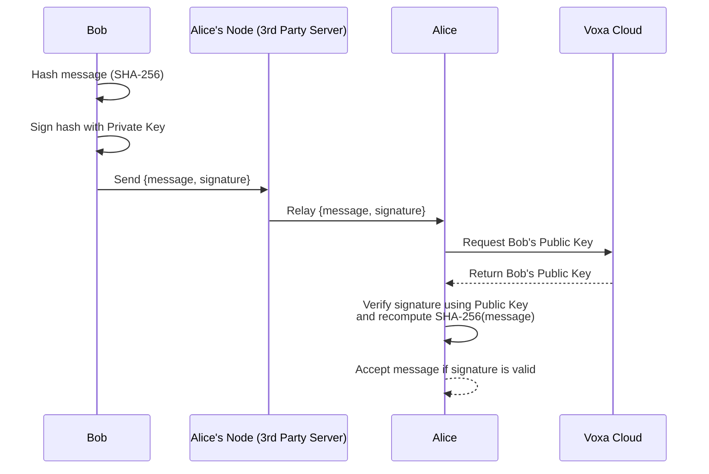

# voxa-node

The server for the DM and notification system of Voxa

## Setup

### Using `config.json` (Usually when you self host)

`cargo run`

### Using `.env`

```python
#.env
VX_CONFIG='{"server_name":"Server Name","server_id":"<required>","server_key":"<required>","port":7090,"channels":[]}'
```

If your env is automatically loaded

```bash
cargo run
```

Run this if you are running on self host or when the .env isn't automatically loaded

```bash
set -a; source .env; set +a
cargo run
```

### What is a Voxa Node?

A voxa node is a server that handles DMs sent to you and push message notifications, a client will keep a constant connection with their chosen node and when a sender wants to send a DM or a message notification they can make a HTTP request to the same port, it's important to note that a node server only handles the receiving side, unless both parties are in the same node.

A analogy to a node is a email server but real time.

### What will a Voxa Node store?

A voxa node stores messages that are sent to you, additionally push notifications and after 3 days of inactivity notifications will be removed.

### Why Voxa Nodes over traditional PM/DM structure

Traditional structures often are a privacy threat even with End-To-End encryption, additionally they are very resource intensive which in my situation is necessary to reduce as much as possible.
Another big issue with the traditional single server structure is that it may apply censorship, our biggest enemy.


